29-04-2023
-----------


### GIT AND GITHUB

* Git:
    * Git is a tool used by developers to manage and track codes. 
    * It allows multiple people to work on a project, modify codes and keep track of changes made to the codebase over time. 
    * Git is installed on your local system rather than in the cloud.

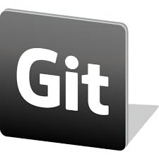

* GitHub:
    * GitHub is used for hosting Git repositories. 
    * GitHub serves as a location for uploading copies of the Git repository. 
    * It allows developers to perform operations like pull requests, issue tracking, and sharing codes with others by giving them the power to make revisions or edits and project management tools.


### Git and GitHub Set Up
* Visit the official Git website and download the version suitable for your operating system. 
* Install the package on your operating system by following the prompts for installation.

* Create a GitHub account by visiting the GitHub website.
* After installing the git, configure your name and email address to identify you as the author of commits to your repositories.

### Git

* Open the command prompt and enter the following commands:
```    
git config –global user.name ‘your-name’
git config –global user.email youremail@illustration.com
```

Note; Replace ‘your-name’ and ‘youremail@illustration.com’ with your name and email address.

* Create a new repository using the following command:
```
git init
```

* Add all files in the current directory to the staged area:
```
git add .
```

* Commit the changes to the repository using the following command:
```
git commit -m ‘commit message’
```

* where ‘commit message’ is the changes you made.

* Check the status of your Git repository using the following command:
```
git status
```

* Transfer files from the local repository to the remote repository using the following command:
```
git push
```

* Transfer files from GitHub to the workspace using the following command:
```
git pull
```

### GitHub

* Creating a repository
* To create a repository on GitHub, click the ‘+” sign in the top right corner of the page and select ‘New repository’. 
* Please provide a name and description of the repository, and select whether you want it to be private or public.

* Clone the repository.
* You need to clone the repository to your local computer. 
* Go to your repository on GitHub and click the green ‘Code’ button. Copy the URL (either HTTPS or SSH). 
* Navigate to the directory where you want to clone the repository using the ‘cd command’ and type the following command 

* — replacing the ‘repository-url’ with the URL you copied.
```
$ git clone repository-url
```

* Make changes with the desired text editor you want and stage all the changes using the git add command.
```
git add .
```

* Commit the changes using the git commit command, where the commit message is the changes you made.
```
git commit -m ‘commit message’
```

* Push the changes using the git push command.
```
git push
```

* Go to the repository on GitHub, click on the pull request tab, and then click on the green ‘New pull request button’.

* With these basic commands, you can use Git and GitHub to manage your code, which is detailed enough to build on.


### Git Stash:

* Git stash is a command that allows you to temporarily save changes you have made in your working directory, without committing them. 
* This is useful when you need to switch to a different branch to work on something else, but you don’t want to commit the changes you’ve made in your current branch yet.

* To use Git stash, you first create a new branch and make some changes to it. 
* Then you can use the command git stash to save those changes. 
* This will remove the changes from your working directory and record them in a new stash. 
* You can apply these changes later. 
* git stash list command shows the list of stashed changes.

* You can also use git stash drop to delete a stash and git stash clear to delete all the stashes.

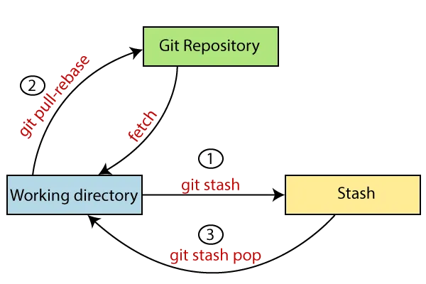


### Cherry-pick:

* Git cherry-pick is a command that allows you to select specific commits from one branch and apply them to another. 
* This can be useful when you want to selectively apply changes that were made in one branch to another.

* To use git cherry-pick, you first create two new branches and make some commits to them. 
* Then you use git cherry-pick <commit_hash> command to select the specific commits from one branch and apply them to the other.


### Resolving Conflicts:

* Conflicts can occur when you merge or rebase branches that have diverged, and you need to manually resolve the conflicts before git can proceed with the merge/rebase. 
* git status command shows the files that have conflicts, git diff command shows the difference between the conflicting versions and git add command is used to add the resolved files.

### Task-01

* Create a new branch and make some changes to it.

* Use git stash to save the changes without committing them.

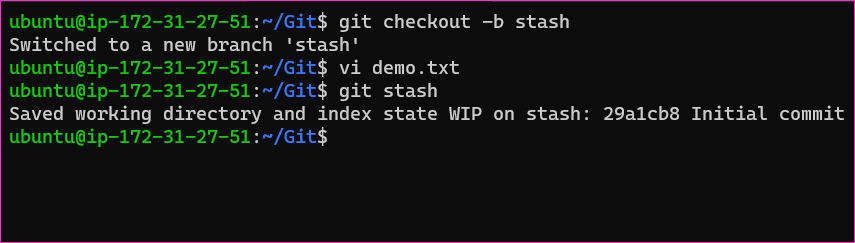


* Switch to a different branch, make some changes and commit them.

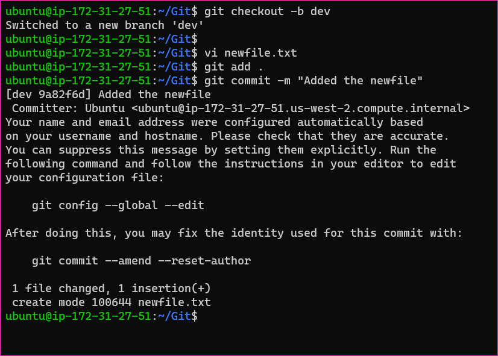

* Use git stash pop to bring the changes back and apply them on top of the new commits.

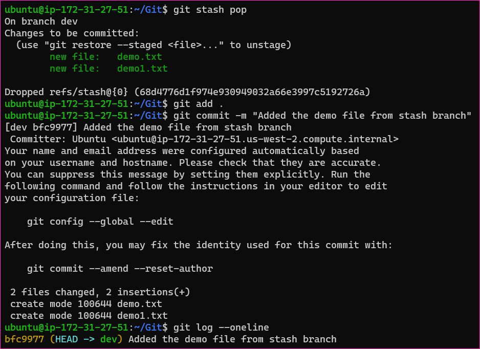
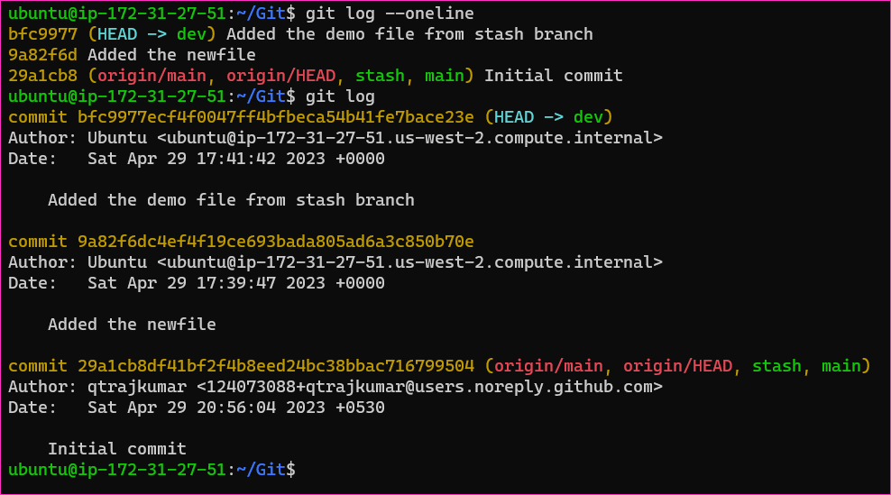


### Task-02

* In version01.txt of development branch add below lines after “This is the bug fix in development branch” that you added in Day10 and reverted to this commit.

* Line2>> After bug fixing, this is the new feature with minor alteration”

* Commit this with message “ Added feature2.1 in development branch”

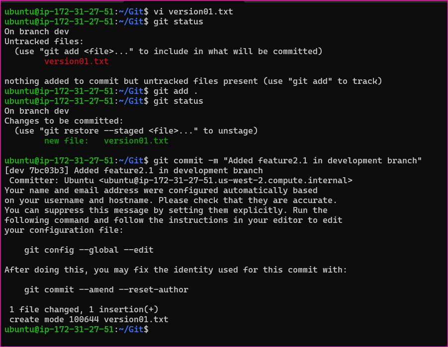


* Line3>> This is the advancement of previous feature

* Commit this with message “ Added feature2.2 in development branch”

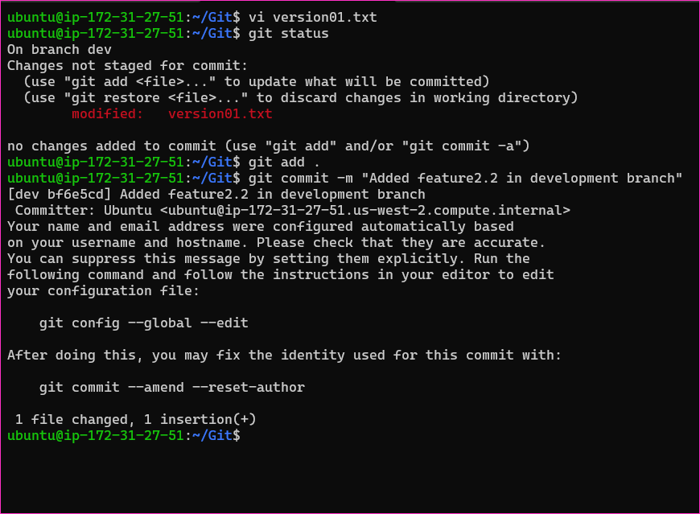

* Line4>> Feature 2 is completed and ready for release

* Commit this with message “ Feature2 completed”

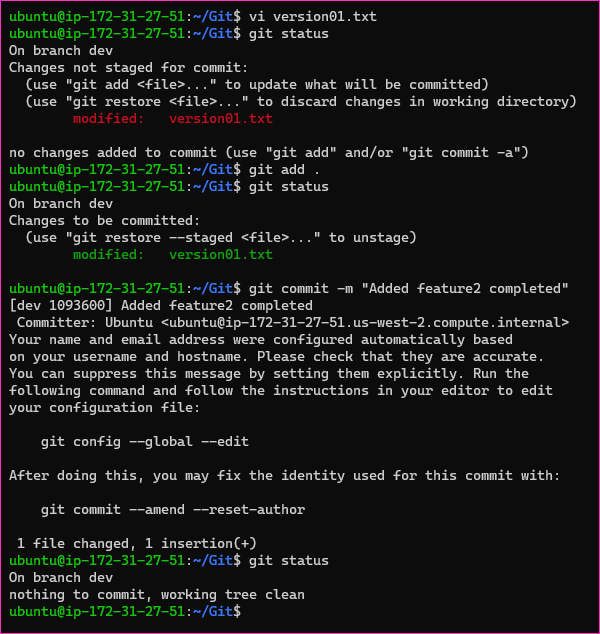

* All these commits messages should be reflected in Production branch too which will come out from Master branch.

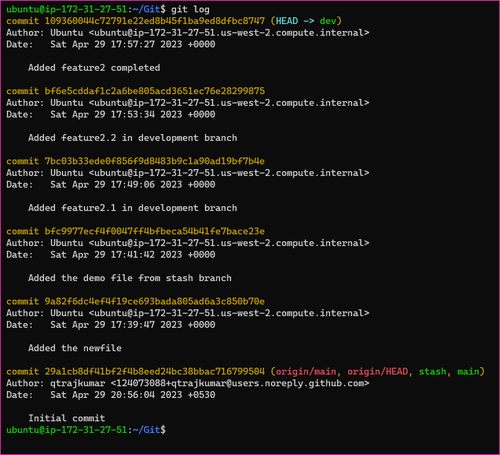


* below, I have switched from dev to production and used git rebase command ,now all the commits are merged in production.
 
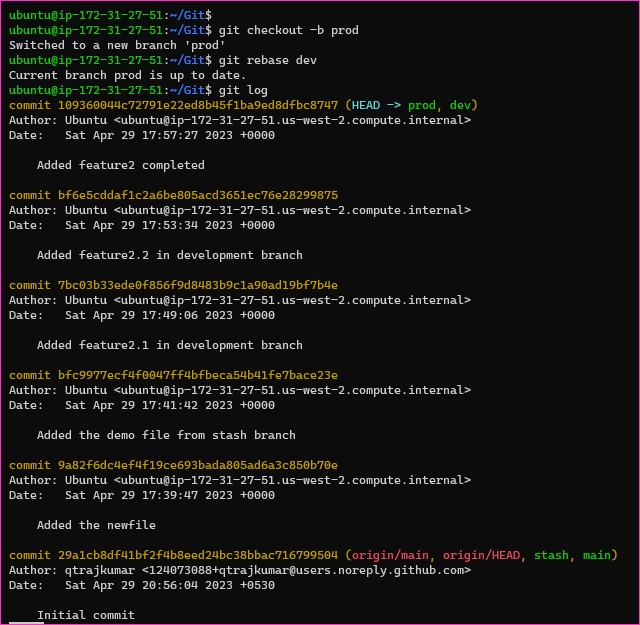


### Task-03

* In Production branch Cherry pick Commit “Added feature2.2 in development branch” and added below lines in it:
    * Switch to production branch.
    * for cherry-pick use command: git cherry-pick <commit ID for feature2.2>
    * here cherry-pick gives conflict error. so we need to solve conflict error.
    
    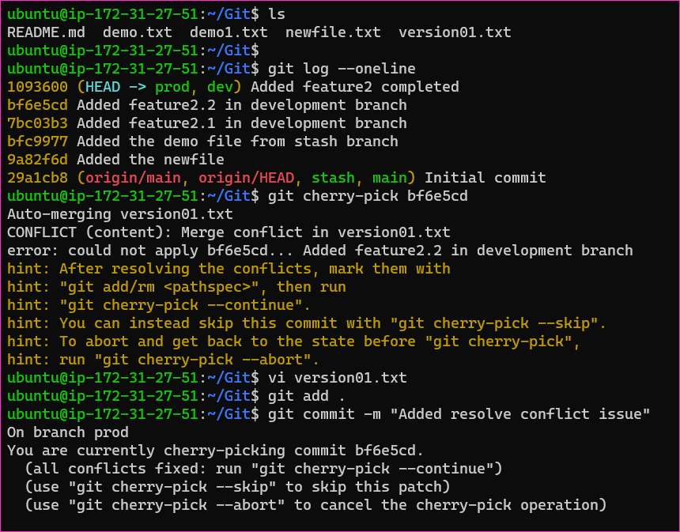
    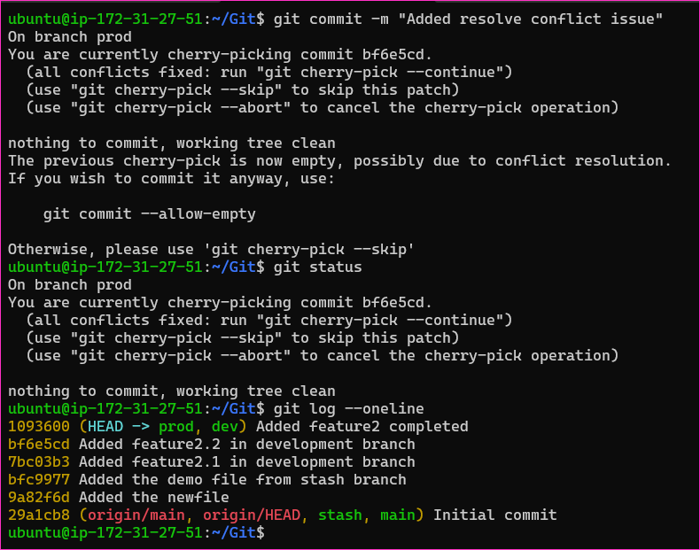

    * After resolving conflict error use command
    ```
    git cherry-pick <commit ID> or 
    git cherry-pick - continue  
    ```

    * In git log, you can check commit is at the top.
    
    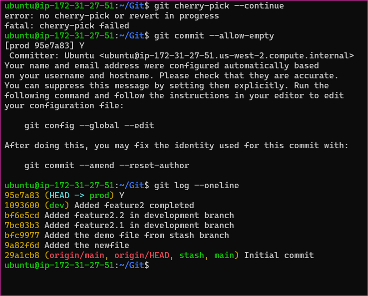

    * Line to be added after Line3>> This is the advancement of previous feature

    * Line4>>Added few more changes to make it more optimized.

    * Commit: Optimized the feature
    
    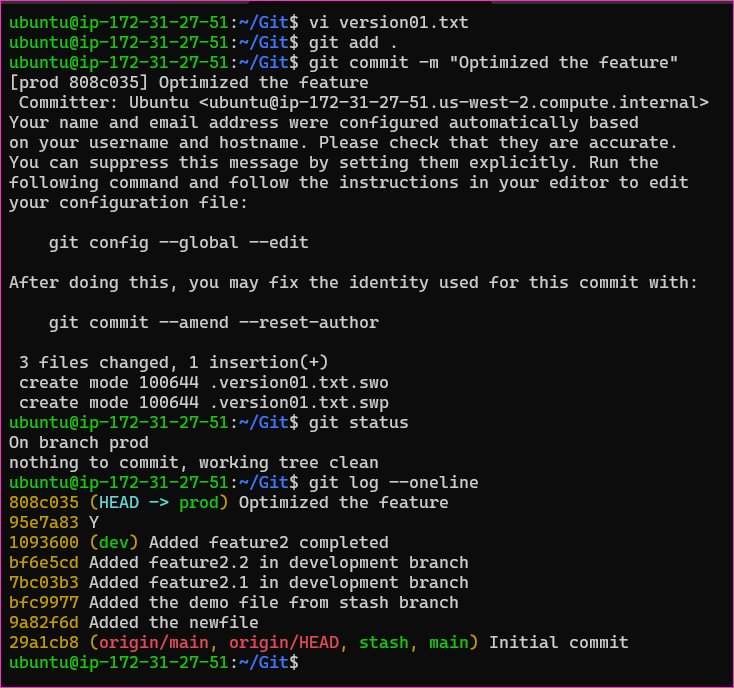

* *THANK YOU FOR READING.*


